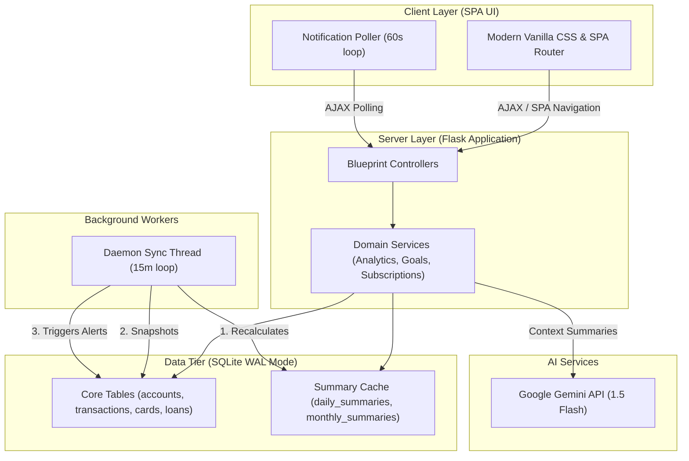

# 🏦 Finance Pro | Intelligent Enterprise Wealth Engine

[](https://python.org)
[](https://flask.palletsprojects.com/)
[](https://sqlite.org)
[](https://deepmind.google/technologies/gemini/)

**Finance Pro** is a high-precision, state-of-the-art wealth management platform and proactive analytical engine. Architected for strict double-entry ledger parity, it dynamically handles complex multi-account interactions, credit card debts, amortized loans, and recurring subscriptions. Equipped with a Gemini-powered AI reasoning layer and an automated background synchronization engine, Finance Pro delivers real-time notifications, budget breaches, and custom predictive insights inside a stunning dark-mode SPA interface.

---

## 👨‍💻 Author & Lead Architect
**PRADYUMNA BEHERA (BAPUN)**  
*Lead Software Architect & Developer*

---

## 📐 System Architecture



---

## 💎 State-of-the-Art Features

### 1. Unified Poly-Account & Dynamic Ledger Routing
*   **Semantic Identifiers (`A`/`C`)**: The universal transaction system separates standard liquid accounts (`A`) and credit card liabilities (`C`) directly within a unified selection dropdown.
*   **Directional Transaction Processing**:
    *   **Card-based Purchases**: Accrues balance dynamically directly against `card_id` without bloating regular bank account outlays.
    *   **Directional Transfers (Bill Payments)**: Deducts cash from liquid assets (`account_id`) and credits outstanding liability limits (`card_id`), maintaining exact ledger integrity.
    *   **Cash Withdrawals**: Seamlessly tracks transfers out of liability limits into liquid banks.
*   **Silent Transaction Flags**: Dedicated migration/EMI paths are tagged as `Silent` to establish debt entries without cluttering the monthly transactional feed.

### 2. Proactive Alert & Automation Engine
*   **Multi-Daemon Worker Thread**: A background execution thread processes analytics, captures daily net-worth histories, and checks budget milestones every 15 minutes.
*   **Real-time Push-Like Notifications**: The frontend polls the notifications API every 60 seconds, updating the unread badge and triggering warning alerts instantly.
*   **Proactive Insights**:
    *   **Budget Breach Audits**: Triggers multi-level warning thresholds (50%, 70%, 90%, 100%).
    *   **Subscription Renewal Trackers**: Pre-calculates dues and alerts the user ahead of billing.
    *   **Goal Velocity Metrics**: Automatically evaluates target date requirements.

### 3. AI Reasoning Engine (Gemini-Powered)
*   **Token-Shield Architecture**: Optimizes API payload sizes using compressed local JSON summaries, minimizing latency and token costs.
*   **Hybrid Query Resolution**: Executes local SQL scripts for direct numerical stats, fallback to Gemini 1.5 Flash for holistic wealth advisory.
*   **Double-Key Cache Guard**: Prevents API duplicate-polling for identical financial contexts.

### 4. Premium Responsive SPA Interface
*   **Zero White-Flash Reloads**: Full SPA client routing with visual transitions and cached pages.
*   **Infinite Drawer Accessibility**: Side drawers support fully custom scrollbars matching the sidebar, making long, comprehensive forms fully accessible.
*   **No Autofill Glitches**: Customized, hardware-accelerated CSS properties ensure inputs don't flicker or overlay white backgrounds on standard browser autofills.

---

## 🛠️ Project Structure

```text
├── database/
│   ├── connection.py        # WAL-enabled SQLite thread connection pooling
│   └── schema.sql           # Complete relational schema (Accounts, Cards, Loans, KPI Caches)
├── models/
│   ├── account.py           # Dataclass maps for Financial Entities
│   └── transaction.py       # Dataclass maps with AI serialization formatters
├── routes/
│   ├── dashboard_routes.py  # Dashboard KPI compiler
│   ├── transaction_routes.py# Polymorphic ledger endpoints
│   └── ai_routes.py         # AI Assistant interfaces
├── services/
│   ├── analytics_service.py # Core KPI aggregation & anomaly detection
│   ├── net_worth_service.py # Dual-entry asset-liability calculus
│   ├── credit_card_service.py # Dynamic credit utilization calculator
│   └── health_service.py    # Algorithmic wealth-health scoring
├── ui/
│   ├── static/
│   │   ├── css/
│   │   │   ├── style.css    # Premium CSS Variables & Glassmorphic rules
│   │   │   └── themes.css   # Dynamic Light/Dark variables
│   │   └── js/
│   └── templates/
│       ├── base.html        # Shell containing global drawers, notifications, and poller
│       └── dashboard.html   # Main analytical dashboard view
├── .env.example             # Configuration templates
├── app.py                   # Server initialization, Blueprint registration, background workers
└── requirements.txt         # Package requirements list
```

---

## 🚀 Installation & Local Environment Setup

### 1. Prerequisites
*   **Python**: Version 3.10 or higher.
*   **OS**: Compatible with Windows, macOS, and Linux.

### 2. Standard Installation
```bash
# Clone this high-performance ledger engine
git clone https://github.com/yourusername/finance-pro.git
cd finance-pro

# Spin up a localized virtual environment
python -m venv venv
source venv/bin/activate  # On Windows, run: venv\Scripts\activate

# Install essential dependencies
pip install -r requirements.txt
```

### 3. Environment Setup
Configure your configuration file by copying the template:
```bash
cp .env.example .env
```
Populate your `.env`:
```env
FLASK_APP=app.py
FLASK_ENV=development
GEMINI_API_KEY=your_google_gemini_api_key
```

### 4. Running the Engine
```bash
python app.py
```
*   Your web environment will compile at `http://127.0.0.1:5000`
*   The background worker starts up concurrently, showing `Analytics worker started.` in your server console logs.

---

## 🔒 Security & Mathematical Parity
*   **Local Privacy Shield**: Absolute localized control. Your SQLite database is stored natively on-disk in `finance.db`.
*   **No Double-Counting**: Transfers between bank accounts and credit cards do not get misattributed as double-expenses. They are dynamically isolated from core outlays, keeping your net worth calculations mathematically flawless.
